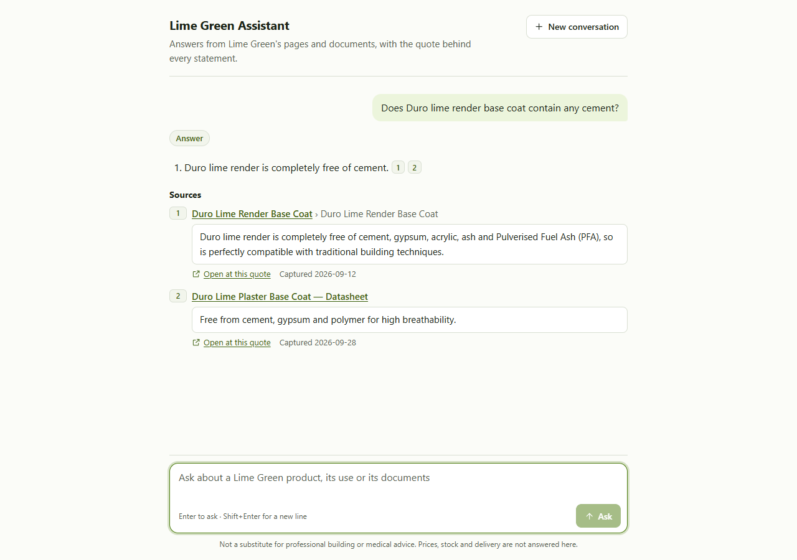
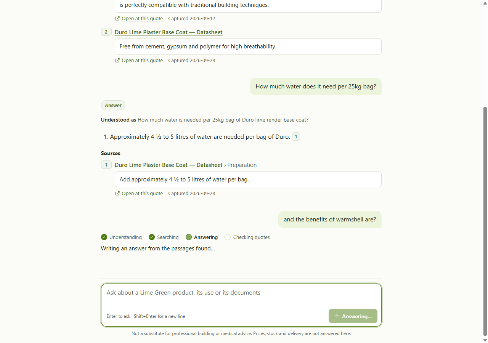
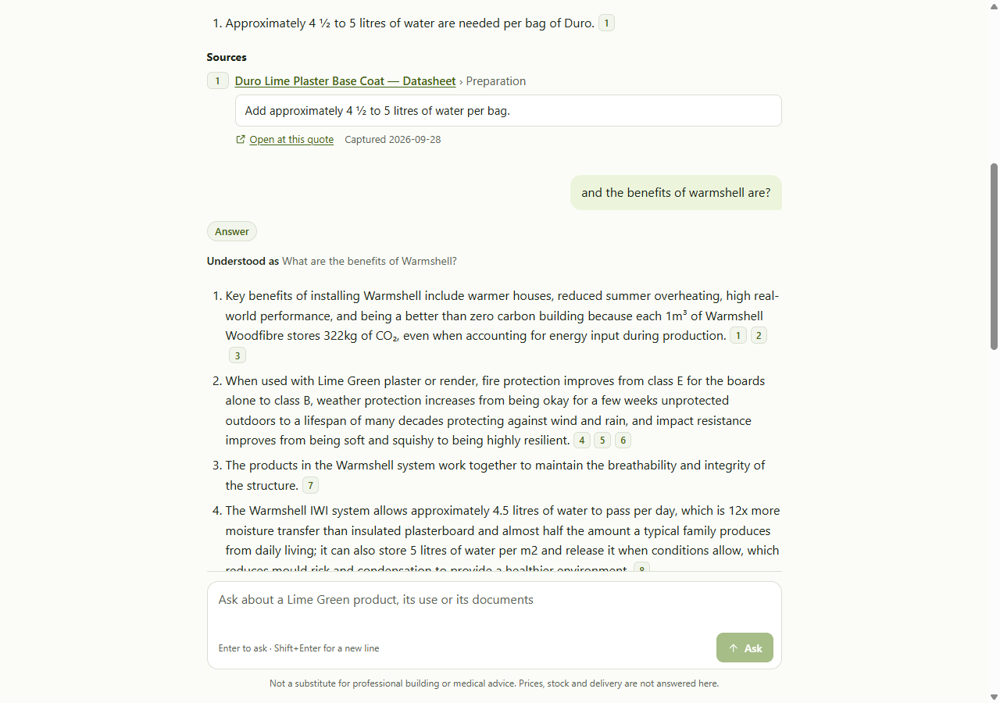
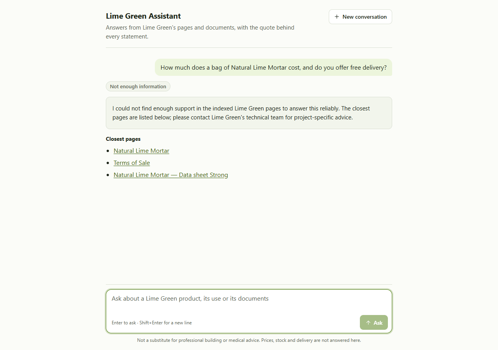
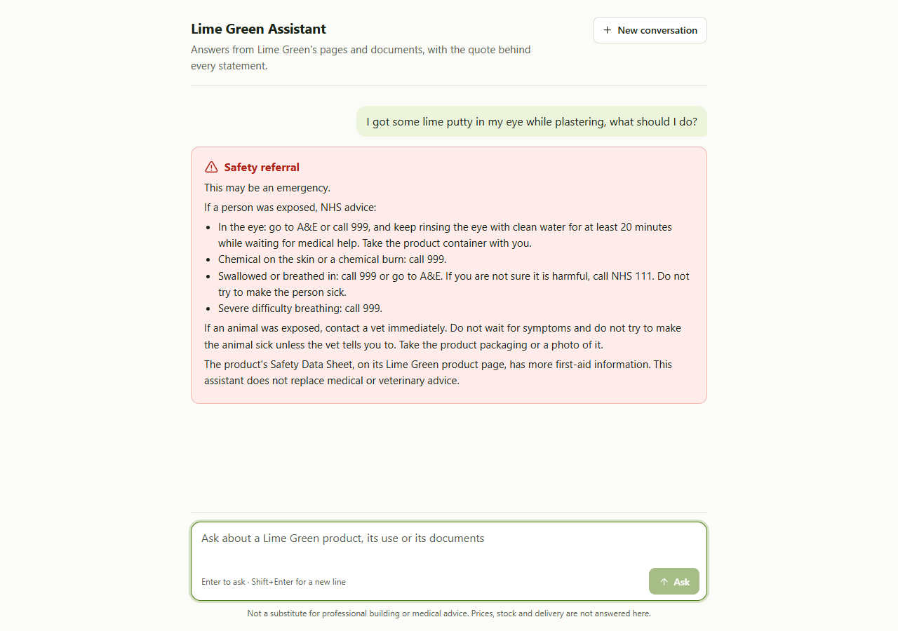

# Lime Green Assistant

A local LLM assistant that answers questions from Lime Green website pages,
shows a checked quotation and page for every displayed model-written claim, and
uses a fixed refusal when no claim has sufficient evidence to pass its checks.

Quotation checks establish where the words came from. They do not prove that a
claim interprets them correctly or answers every part of a question. The results
below show both successes and remaining failures.

> **Status, October 2026.** The interview submission (tag `submission-v2`) has been
> developed into a platform: a Postgres index of Lime Green's site, data sheets,
> declarations, pictures and two GOV.UK documents; conversations with follow-up
> questions; and a web app. Every change is measured against tag `v5-baseline`, and
> the platform's results are under *Results*. It runs locally and is not yet deployed
> publicly; the screenshots below come from a local run on 8 October 2026. The submission's
> evaluation notebook and result files stay at commit
> [`377a4fe`](https://github.com/Nduka99/lime_green_ai_assistant/tree/377a4fe).

```text
question (+ the last 4 turns the reader saw)
  -> understanding: emergency check, standalone search questions
  -> keyword + vector search for each, pictures and guidance ranked apart -> reranking
  -> local LLM -> quote, number and regulation checks -> answer with sources
```

## Screenshots

The web app on index version 28, with Gemma 4 26B-A4B on an 8 GB laptop GPU.

**An answer with its sources.** Each claim cites passages; each source shows the checked
quotation, a link that opens the live page at that quote, and when the page was captured.



**A follow-up in the same conversation.** "It" is resolved from the earlier turn, and the
reader sees what the question was understood as. The next question shows the stages as they run.



**Several sources in one answer.** Five claims, each tied to the quotations that support it.



**Not enough information.** A price question gets the fixed refusal and the closest pages, never a
guessed figure.



**Safety referral.** A question describing an exposure gets fixed NHS and vet text; the model writes
nothing.



## Example answers

Real output from the submission's setup (September: Qwen3.6-35B-A3B on an 8 GB laptop
GPU, 68 indexed pages), one question for each kind the brief asks to test; the
platform's answers draw on more sources and differ in wording. Links are shortened here; each
opens the live page at the quoted sentence.

**Straightforward:** `uv run --env-file .env limespec ask "Does Duro lime render base coat contain any cement?"`

```text
Answer:
1. Duro lime render base coat is completely free of cement. [1]

Sources:
[1] Duro Lime Render Base Coat › Duro Lime Render Base Coat (captured 2026-09-12)
    "Duro lime render is completely free of cement, gypsum, acrylic, ash and Pulverised Fuel Ash (PFA), so is perfectly compatible with traditional building techniques."
    https://www.lime-green.co.uk/products/lime-render/duro#:~:text=Duro%20lime%20render…
```

**Several sources** (the brief's example question): `uv run --env-file .env limespec ask "What products are suitable for lime-based external finishes?"`

```text
Answer:
1. Lime Green offers lime-based external finishes suitable for base applications including timber frame, lightweight blocks, and brick, and they can be used with Ultra or Duro as the base coat. [1] [2]
2. Natural Finish is a self-coloured external lime render that requires no further painting. [3]
3. Finish WP is a specialist lime finish coat render for the Warmshell insulation system that offers protection against rain and other elements. [4] [5]

Sources:
[1] Lime Render › Lime Render (captured 2026-09-12)
    "We have a range of products to suit most base applications from timber frame to lightweight blocks, brick and more."
    https://www.lime-green.co.uk/products/lime-render#:~:text=We%20have%20a…
[2] Natural Finish Lime Render › Natural Finish Lime Render (captured 2026-09-12)
    "whether you use Ultra or Duro as the base coat."
    https://www.lime-green.co.uk/products/lime-render/natural-finish#:~:text=whether%20you%20use…
[3] Natural Finish Lime Render › Natural Finish Lime Render (captured 2026-09-12)
    "Natural Finish is self coloured external lime render requiring no further painting."
    https://www.lime-green.co.uk/products/lime-render/natural-finish#:~:text=Natural%20Finish%20is…
[4] Finish WP External Lime Render › Finish WP External Lime Render (captured 2026-09-12)
    "A specialist lime finish coat render for the Warmshell insulation system."
    https://www.lime-green.co.uk/products/lime-render/finish-wp#:~:text=A%20specialist%20lime…
[5] Finish WP External Lime Render › Finish WP External Lime Render (captured 2026-09-12)
    "Special additives in this external lime render offer the very best protection against rain and other elements."
    https://www.lime-green.co.uk/products/lime-render/finish-wp#:~:text=Special%20additives%20in…
```

This answer is supported but incomplete. It misses Tradirend, the third finish
coat, and its first claim joins a general line about the range to a Natural
Finish detail. Every model tested missed Tradirend; *Results* explains why.

**Insufficient information:** `uv run --env-file .env limespec ask "How much does a bag of Natural Lime Mortar cost, and do you offer free delivery?"`

```text
Answer:
I could not find enough support in the indexed Lime Green pages to answer this reliably. The closest pages are listed below; please contact Lime Green's technical team for project-specific advice.

Closest pages:
- Natural Lime Mortar: https://www.lime-green.co.uk/products/lime-mortar/natural-lime-mortar
- Lime Mortar: https://www.lime-green.co.uk/products/lime-mortar
- What Is Lime?: https://www.lime-green.co.uk/support/knowledgebase/what-is-lime
```

## How it meets the brief

| The assistant should | How | Where |
|---|---|---|
| Retrieve relevant information | Keyword search (BM25) and vector search over 2,355 passages from 268 documents (the site's pages, its PDF and Word documents, the pictures they show, two GOV.UK documents), merged and reranked; company content, pictures and guidance are ranked apart, and each thing a question asks about is searched on its own | `ingest.py`, `retrieve.py`, `assistant.py` |
| Use a local LLM to answer | Gemma 4 26B-A4B on llama.cpp returns short claims, each with the exact quote it relies on | `answer.py`, `llm.py` |
| Provide the sources | Every factual claim the model writes lists its page, section, quote, capture date and a link to the quote on the live page; refusals and safety referrals are fixed text | `verify.py`, `view.py` |
| Minimise unsupported information | Code checks every quote is in the cited passage, and every number and named regulation is in the quote; a failing claim is removed, never repaired | `verify.py` |
| Say when information is insufficient | The model reports what the pages cannot answer; the reader gets a fixed refusal and the closest pages, or a caution when only part is answered | `answer.py` |

The answer path is `assistant.py` → `answer.py` → `retrieve.py` → `verify.py`; the
application is about 7,000 lines of Python in `src/limespec/`, and the web app is in
`web/`.

## Design decisions

- **Local inference.** llama.cpp runs the generator, the embedding model and the
  reranker as local servers (and GLM-OCR, which reads tables and pictures, while an
  index is built). Questions and model requests stay on the machine. Fetching pages
  and opening source links access the website.
- **Gemma 4 26B-A4B writes the answers, with thinking off.** Compared on the same
  retrieved passages by rules written before each run (E8, ADR 0029), it answered 50
  of 203 near-miss questions it should have refused, against 76 for Qwen3.6-35B-A3B,
  the submission's model, and answered 243 of 244 answerable ones. It uses about 4
  billion of its 26 billion parameters per token, so its expert layers sit in system
  RAM while search stays on the 8 GB graphics card.
- **Two kinds of search, then a reranker.** Keyword search (BM25) finds exact
  product names and vector search (Qwen3-Embedding 4B, on the CPU) finds the same idea
  in other words; reciprocal-rank fusion merges the two lists, and a cross-encoder
  (BGE v2-m3) reorders them so the answer passage comes first more often. Company
  content fills an answer's eight places; pictures (found by their words and, with
  SigLIP2, by what they show) and GOV.UK guidance are ranked apart and added after it
  (ADRs 0030 and 0032).
- **Postgres, not a separate vector database or RAG framework.** The submission kept
  its 315 passages in one SQLite file; the platform keeps them in Postgres (pgvector
  and BM25), with every index version and answer recorded, measured to rank as well
  (`evaluation/reports/X2-store-parity.md`). Every step is plain Python that can be read
  and tested.
- **Evidence checked by code, not trusted.** The model must quote; code decides what
  the reader sees. A claim whose quote, numbers or named regulations are not in the
  cited passage is removed, never repaired, and the reader sees a caution.
- **Fixed text where guessing is risky.** Refusals use fixed wording. A separate
  first model request checks whether the question describes an accident (a product
  swallowed, or in the eyes or on the skin); if it does, the reader gets fixed NHS
  and vet referral text and the model writes nothing.
- **Sources chosen by rule.** Every page in the sitemap (160), the PDF and Word
  documents they link (Docling reads layout and reading order, GLM-OCR table structure
  and pdfium what each page shows; Word files go through LibreOffice), the pictures
  they show (each read for its own words: alt text and the text in it, never a
  generated description), and two GOV.UK documents (Open Government Licence), not
  pages picked to suit test questions. Fetching follows `robots.txt` and waits a
  second between requests.
- **Conversations, one standalone question at a time.** Only the first model request
  reads the last four turns, as the reader saw them; it rewrites a follow-up such as
  "how much water does it need?" into standalone search questions, and everything
  after it answers one question as before. The server keeps the history, and a client
  cannot send one (X36, ADR 0035).

## Constraints

- One laptop with an 8 GB NVIDIA GPU (RTX 4060) and 64 GB of RAM. The submission's
  three servers used about 25 GB of system RAM and at most 6.3 GB of GPU memory; Gemma
  in one slot beside the reranker, with the embedder on the CPU, holds about 5.2 GB of
  the GPU (X36). Another machine needs at least 32 GB of RAM and an 8 GB NVIDIA GPU.
- Pictures are read for their words only, so questions about what something looks
  like are refused. Live prices, stock and delivery are outside the knowledge base.
- A platform in development, not yet deployed, and not a substitute for professional
  building or medical advice.
- The model decides whether an answer is complete and whether a question
  describes an exposure. These decisions can fail even when quotation checks pass.
- A fresh ingest reads the current website. Page counts, passage counts and
  answers can change if the site changes; the saved evaluation describes the
  September 2026 snapshot, whose fingerprints are recorded in the submission's
  notebook (commit `377a4fe`).

## Install

You need Python 3.12, a recent
[llama.cpp release](https://github.com/ggml-org/llama.cpp/releases) with GPU
support (tested with build b10298), and [uv](https://docs.astral.sh/uv/).
Put `llama-server` on your `PATH`. The tested setup used Windows, an 8 GB NVIDIA
GPU and 64 GB of RAM; the Python application itself has no platform-specific
paths.

One command installs everything: the application, its tests and the `ingest` group
(Docling, the layout-aware PDF parser, with CPU PyTorch: about 300 MB of packages;
Docling's layout and table models, about 500 MB, download on the first PDF parse).

```powershell
uv sync --all-groups --locked
```

`uv sync --locked` installs the application and its tests without the `ingest` group.
`uv.lock` pins every version; uv recommends it over a second `requirements.txt`.

## Build the search index

Run every command from the repository root. Model files (`models/`), fetched
pages and the index (`data/`) stay on your machine and are never committed.
`models.json` lists every model file the project uses, with its source, revision,
size, SHA-256 and licence; `uv run limespec models` checks the files in `models/`
against it (`--quick` compares sizes only).

1. Copy `.env.example` to `.env` and set its values, including a long random
   `LIMESPEC_MODEL_API_KEY`. Every model server needs it: set `LLAMA_API_KEY` to the
   same value in the terminal before starting one, and requests without it are refused.
   Download `Qwen3-Embedding-4B-Q8_0.gguf` from
   [Qwen3-Embedding-4B-GGUF](https://huggingface.co/Qwen/Qwen3-Embedding-4B-GGUF/tree/main)
   into `models/Qwen3-Embedding-4B-GGUF/` and start the embedding server on the CPU:

   ```powershell
   llama-server -m models/Qwen3-Embedding-4B-GGUF/Qwen3-Embedding-4B-Q8_0.gguf --embedding --pooling last -np 1 -c 2048 -b 2048 -ub 2048 --device none --port 8084
   ```

2. Start Postgres inside WSL (`docker compose -f deploy/compose.yaml --profile dev
   up -d`, which also applies the migrations in `db/migrations/`), then fetch the pages
   listed in `sources.txt` (cached in `data/site/`, one second apart) and index them.
   Each run adds a new index version and makes it live:

   ```powershell
   uv run --env-file .env limespec ingest
   ```

   `--no-live` builds a candidate version beside the live one (`--sources` names
   another list of pages); set `LIMESPEC_INDEX_VERSION` to serve it while it is
   evaluated.

   To collect the rest of the site for the knowledge base, with the same politeness:
   every sitemap page, then the site's own PDFs and images, then the openly licensed
   documents listed in `sources-external.txt` (stored once each by SHA-256 in
   `data/files/`, with a manifest). `--measure` sizes them first, and `browse` gives
   every stored file its readable name under `data/browse/`:

   ```powershell
   uv run limespec acquire pages --measure
   uv run limespec acquire pages
   uv run limespec acquire files
   uv run limespec acquire external
   uv run limespec browse
   ```

3. Read every stored PDF into elements (the `ingest` group). Each document is read
   in its own process and saved in `data/elements/` with a fingerprint of what read
   it; a run skips documents already read the same way, and writes
   `data/elements/report.json` with every page it flags (ADR 0027). `--vlm` reads each
   table's structure again with GLM-OCR from a llama.cpp server started beforehand
   with the generator stopped (it needs the GPU):

   ```powershell
   uv run --group ingest python -m limespec read-pdfs
   uv run --group ingest --env-file .env python -m limespec read-pdfs --vlm http://127.0.0.1:8083
   ```

4. Read every stored picture (GLM-OCR for the text in it, SigLIP2 for what it shows),
   then build the version the platform is measured on (version 28's options):

   ```powershell
   uv run --group ingest --env-file .env python -m limespec read-images --vlm http://127.0.0.1:8083 --vectors
   uv run --env-file .env limespec ingest --no-live --all-pages --pdf-form page --web-form page --images --compiled-descriptions
   ```

5. See which passages a question retrieves (this also needs the reranker server
   from "Ask questions" below):

   ```powershell
   uv run --env-file .env limespec search "What is Grippa used for?"
   ```

## Ask questions

Answering needs three servers: the embedding server from step 1, the reranker
and the generator. Download `bge-reranker-v2-m3-Q8_0.gguf` from
[bge-reranker-v2-m3-GGUF](https://huggingface.co/gpustack/bge-reranker-v2-m3-GGUF/tree/main)
and `gemma-4-26B-A4B-it-UD-Q4_K_XL.gguf` (17 GB) from
[gemma-4-26B-A4B-it-GGUF](https://huggingface.co/unsloth/gemma-4-26B-A4B-it-GGUF/tree/main)
(the files whose SHA-256 `models.json` records). Put both in `models/` and start
each in its own terminal, with `LLAMA_API_KEY` set as in step 1:

```powershell
llama-server -m models/bge-reranker-v2-m3-Q8_0.gguf --reranking -np 1 -c 2048 -b 2048 -ub 2048 --cache-ram 0 -ngl all --fit off --port 8082
llama-server -m models/gemma-4-26B-A4B-it-UD-Q4_K_XL.gguf -c 16384 -np 1 -ngl all --n-cpu-moe 99 --fit off --load-mode none -b 2048 -ub 2048 --cache-ram 0 --port 8080
```

`--n-cpu-moe 99` keeps every expert layer in system RAM, so the reranker fits beside
Gemma on an 8 GB card; `--cache-ram 0` stops each server keeping finished requests in
RAM (8 GiB by default). Serve version 28 by setting `LIMESPEC_INDEX_VERSION=28`, or
make it live once it has passed its gates.

Then ask on the command line, or run the web page:

```powershell
uv run --env-file .env limespec ask "What is Grippa used for?"
uv run --env-file .env limespec ask      # prompts "Ask a question:"
uv run --env-file .env limespec serve    # the web app at http://127.0.0.1:8090 (--port to change)
```

The web app is a conversation thread (React and TypeScript, in `web/`). Build it once
with [Node.js](https://nodejs.org/) 24, and `limespec serve` serves it from `web/dist`:

```powershell
npm ci --prefix web          # the versions pinned in web/package-lock.json
npm run build --prefix web   # type-checks, then writes web/dist
```

For work on the app itself, `npm run dev --prefix web` serves it on port 5173 and
passes `/api` to a running `limespec serve` (`API_URL`, default port 8090). Its types
come from the API's schema: after an API change, run
`uv run limespec openapi web/openapi.json` and `npm run types --prefix web` (a test
fails until the committed schema matches the API).

The command line, the page and the JSON API (`POST /api/v1/answers`, or
`/api/v1/answers/stream` for stage-by-stage progress) give the same answer from the
same checks and presentation data. Separate model requests can still produce
different wording, even with a fixed seed.

The API holds conversations. A request without `conversation_id` starts one; the reply
carries `conversation_id`, `turn` and `understood_as` (the search questions the follow-up
was read as) beside the answer, and the next request sends the id back:

```json
{"question": "How much water does it need per 25kg?", "conversation_id": "0b9f4c1e-…"}
```

The server rebuilds the last four turns from what it showed, so a client cannot send a
history (any extra field is refused with 422). A conversation ends after 30 idle
minutes, 8 hours or 20 turns; continuing it then returns 404 with a fixed message to
start a new one (`evaluation/reports/X36-follow-ups.md`, ADR 0035).

To trace and measure answers, start VictoriaTraces and VictoriaMetrics inside WSL
(`docker compose -f deploy/compose.yaml --profile observability up -d`) and serve with
`uv run --env-file .env limespec serve`. Each request is one trace, with a span per
stage and per model call (token counts, no question or answer text), at
http://localhost:10428/select/vmui. Metrics (model-call durations, tokens, answers by
status, claims kept and removed, request durations) are at http://localhost:8428/vmui.
`limespec serve` writes its log as JSON lines on stdout; a line written during an
answer carries that answer's `trace_id`.

## Tests

```powershell
uv run python scripts/check.py # every check a change must pass, in one command
uv run pytest                  # Python tests, 100% coverage; no models, but the dev Postgres
npm test --prefix web          # the web app's tests, 100% coverage
npm run e2e --prefix web       # the thread in Microsoft Edge, with WCAG 2.2 AA checks (axe)
uv run pytest -m live --no-cov # the brief's three kinds of question, with the servers running
uv run ruff check . ; uv run mypy src tests evaluation
```

The offline tests use invented pages and a fake model, so they check the rules
themselves: quote matching, number and regulation checks, refusals, safety
routing, retrieval fusion and reranking, page parsing, malformed server replies,
and that the command line and web page render the same answer data.

The Postgres tests (`tests/test_store.py`) use a throwaway database on the
development server, so start it first, from the repository root inside WSL:
`docker compose -f deploy/compose.yaml --profile dev up -d`.

### Measurement harness

`evaluation/` scores keyed question sets. Keys and saved runs stay in git-ignored
`data/eval/`; `evaluation/sets.json` records each file's SHA-256, and every
command refuses a set whose files have changed. Reports are in
`evaluation/reports/`.

```powershell
uv run python -m evaluation verify                        # check every set's hashes
uv run python -m evaluation retrieval frozen90            # IR measures from saved runs
uv run python -m evaluation grades heldout-v3 sitting-topk
uv run python -m evaluation ask heldout-v3 --target http://127.0.0.1:8095 --run platform
uv run python -m evaluation ask heldout-v3 --target http://127.0.0.1:8090 --run v5 --endpoint /api/answer   # the submitted v5
uv run python -m evaluation blind heldout-v3 A.json B.json --seed 28 --out DIR   # differing answers, runs hidden
uv run python -m evaluation unblind heldout-v3 A.json B.json --dir DIR           # after DIR/verdicts.json is written
```

## Results

### The platform (October)

Every experiment's rules were written before its run, and every question set was
registered by SHA-256 before use. The full records are in `evaluation/reports/` and
`docs/adr/`.

- **Held-out v6 (E9, ADR 0033):** 284 questions (213 cases), graded blind against a
  locked key. The release bar requires at most 5% wrong answers; v6 fails it on risk:
  11 of 126 answered cases wrong (Wilson upper bound 15.0%). Safety and refusals pass:
  every emergency referred, no price shown, 29 of 30 refusals. Single questions of the
  simple, condition, comparison, false-premise and injection kinds had **0 wrong in
  65** answered; the wrong cases came from picture parts answered from a picture's
  printed words, same-kind substitution, and lists joined across sources.
- **Conversations (X36, ADR 0035):** on 20 conversations (86 turns), rewriting
  follow-ups with the last four turns raised sound answers from 30 to 48 of 60
  follow-ups (+0.300, 95% interval +0.150 to +0.464, conversations resampled), with 4
  wrong against 15; every emergency turn was referred and no injected instruction was
  followed. Through the running API, the stored conversations reproduced the measured
  answers on 86 of 86 turns.
- **Accepted limits until after deployment:** substitution (no detector reached 0.76
  AUC, E5–E8), what a picture shows (ADR 0034), and borderless label–value tables read
  column by column in a few data sheets. Retrieval is frozen (ADR 0032); held-out v5
  stays sealed for the final certification.

### The submission (September)

These are the submission's results. Its notebook, which shows the measurement behind
each engine change and charts both evaluations below, and the result files it reads
are at commit
[`377a4fe`](https://github.com/Nduka99/lime_green_ai_assistant/tree/377a4fe)
(`notebook/engine_evaluation.ipynb`, `evaluation/results/`).

**Held-out comparison (run last).** 60 new questions (12 cases, each asked five ways,
including rushed and misspelt wordings) were typed into the running web page one at
a time, for each model in turn. Judges compared two models' answers to the same
question against a locked answer key and chose the better one or a tie: two fresh
LLM chats that had never seen the project judged all 180 pairs, and a third settled
the 16 they decided differently. Bradley-Terry turns those verdicts into one
strength per model.

| Generator | Strength (log), 95% interval | Median time per answer |
|---|---|---|
| Qwen3.6-35B-A3B (shipped) | +0.18 (0.04 to 0.33) | 12.7 s |
| Gemma 4 26B-A4B | +0.18 (0.03 to 0.33) | 15.3 s |
| Nemotron 3 Nano 4B, 8-bit | −0.36 (−0.55 to −0.18) | 11.0 s |

Qwen and Gemma cannot be separated: Bradley-Terry gives each a 50% chance of beating
the other, so Qwen, already deployed, stayed. Times run from clicking Ask to the
answer page; Gemma and Nemotron ran with only part of their layers on the 8 GB card.

The held-out questions are harder than the frozen set: 40 of the 60 need several
pages or several parts, and 15 are answered only outside the indexed pages (image
descriptions and the sample-order and colour pages). Every held-out answer was also
graded against the locked key by a blind LLM grader, on the frozen evaluation's
sound / partial / wrong scale (`evaluation/results/heldout-v2-graded.json` at
`377a4fe`):

| Generator | Sound / partial / wrong, 45 answerable from the indexed pages | All 60 |
|---|---|---|
| Qwen3.6-35B-A3B (shipped) | 23 / 21 / 1 | 23 / 21 / 16 |
| Gemma 4 26B-A4B | 27 / 15 / 3 | 27 / 15 / 18 |
| Nemotron 3 Nano 4B, 8-bit | 20 / 18 / 7 | 20 / 18 / 22 |

Gemma gave more fully sound answers and Qwen the fewest wrong ones. On the 15
questions answered outside the index every model was graded wrong, mostly for
refusing.

**Frozen evaluation (chose the model).** 90 questions (18 cases, each asked five
ways) whose expected answers were locked before the engine was built. Two blind LLM
judges graded every answer, and I settled their disagreements.

| Generator (same retrieved passages) | Sound / partial / wrong, of 90 | Median time per answer, search included |
|---|---|---|
| Qwen3.6-35B-A3B | 77 / 8 / 5 | 12.0 s |
| Gemma 4 26B-A4B | 74 / 10 / 6 | 14.0 s |
| Nemotron 3 Nano 4B | 36 / 23 / 31 | 5.2 s |

The readable record of these questions and expected answers is
`evaluation/questions.md` at `377a4fe`.

**What worked**

- No model-written claim reaches the reader without a quote that code found in the
  cited passage, and each quote opens on the live page in one click.
- In both evaluations every model sent every accident question to the fixed
  referral and refused every price question; on the held-out questions every model
  also refused the figure the site does not give, and no model followed an
  injected instruction.
- Reranking ranked the answer passage first for 34 of the 70 frozen questions
  that have one, against 27 without reranking.

**What did not**

- Nemotron 3 Nano 4B, the first model deployed, was sound on 36 of 90 frozen answers
  against 77 for Qwen on identical passages, and 16 of its 31 wrong answers refuse
  questions the pages do answer; that is why Qwen ships.
- Every model over-reassures on Building Regulations questions.
- Answers drawn from several pages are often incomplete: the external-finishes
  answer above misses Tradirend, because the search step never passes its
  description to the model.
- Some facts are outside the 68 indexed pages: 15 of the 60 held-out questions are
  answered only in image descriptions or on the sample-order, terms and colour
  pages, and the models mostly refused them.
- A method adapted from my thesis research (an evidence graph linking products
  across pages, with a cited summary of each product) brought the passages for 112
  of the 125 expected answer parts to the model, the same as search alone on the
  same pages, and indexing the whole website made search worse. Neither is in this
  submission.

**Next, with more time**

- Search each part of a many-part question separately. Tried after the frozen
  evaluation on questions built by joining evaluation questions, it raised the parts
  answered correctly from 10 to 14 of 18 (one grader), but made answers about 70%
  slower (median).
- With more graphics memory, run the model and search entirely on the GPU.
- As an experiment, cache-augmented generation (CAG): load the whole knowledge base,
  about 37,000 tokens, into the model's context once and reuse it for every
  question, so no search step can miss a passage such as Tradirend's. Worth testing
  only if memory, the size of the knowledge base and the structure of its pages
  allow.
- With Lime Green's own enquiries, fine-tune the embedding model and reranker on
  customers' wording, fine-tune a small model on verified answers for lighter
  machines, and add the PDF data sheets.
- Have Lime Green's domain experts write and grade the evaluation questions and
  answer keys, instead of synthetic sets drafted by LLMs without that domain
  context.

## How it was evaluated

For the frozen evaluation, the expected answers were written and locked before the
engine was built and were not opened until all 270 answers had been saved. Two LLM
judges from different model families then graded every answer without knowing which
model wrote it, and I settled their disagreements and applied the locked
forbidden-answer rules. For the held-out comparison, fresh LLM chats that had never
seen the project judged the answers in pairs, with a judge from a third model family
breaking their disagreements; each held-out answer was then graded against the locked
key by a blind LLM grader that did not know which model wrote it. This grading was
offline and is not part of the running assistant.

For the platform's evaluations, question sets and keys were written by a separate
model family, in chats that had never seen the system, and registered
before any run. One LLM grader then graded every answer blind against the key by
`evaluation/briefs/grading-guide.md`, with the answers' systems hidden until every
verdict was saved.

## Licence

MIT; see `LICENSE`.
